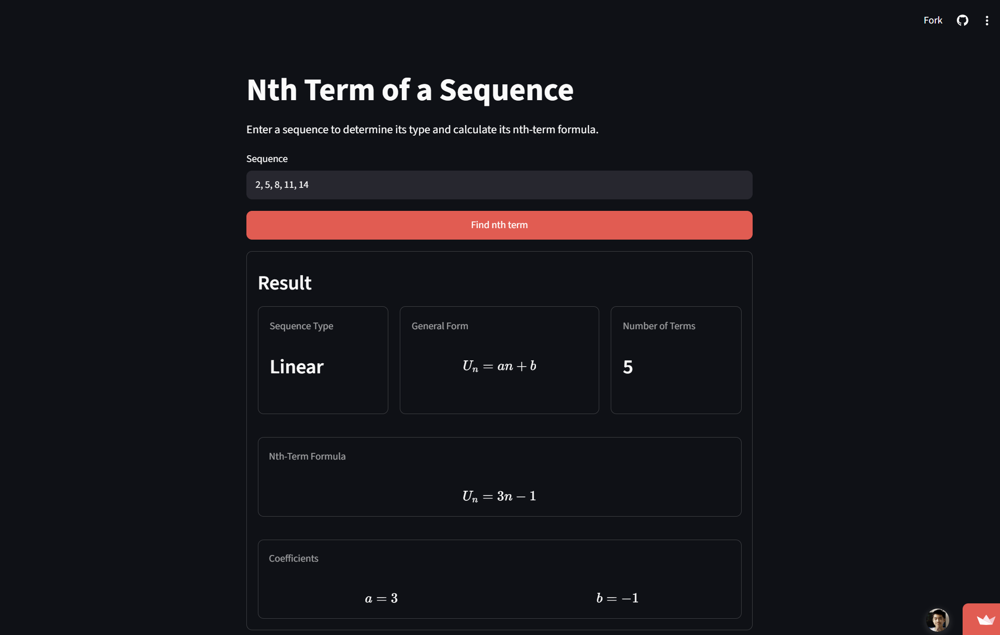

# Nth Term of a Sequence

A Python-based tool that identifies common sequence types and calculates their nth-term formulas.

[**Try it online →**](https://nth-term-of-a-sequence.streamlit.app/)

[](docs/img/nth_term_screenshot.png)

The calculator currently supports **arithmetic, quadratic, cubic, and geometric sequences**. It combines a Python calculation library with a simple Streamlit web interface.

## Features

* **Sequence identification:** Automatically identifies supported sequence types from the provided terms.
* **Nth-term calculation:** Calculates the nth-term formula for the identified sequence.
* **Coefficient display:** Displays the coefficients used to construct the nth-term formula.
* **Multiple sequence types:** Supports arithmetic, quadratic, cubic, and geometric sequences.
* **Input validation:** Handles invalid, incomplete, and unsupported sequence inputs with appropriate feedback.

## Supported Sequence Types

| Sequence Type   | General Form                        |
| --------------- | ------------------------------------|
| **Arithmetic**      | $$U_n = an + b$$                    |
| **Quadratic**   | $$U_n = an^2 + bn + c$$             |
| **Cubic**       | $$U_n = an^3 + bn^2 + cn + d$$      |
| **Geometric** | $$U_n = ar^{n-1}$$                  |


## Getting Started

### Prerequisites

* Python 3.14 or later
* Git

### Installation

Clone the repository and navigate into the project directory:

```bash
git clone https://github.com/devinlin89/nth-term-of-a-sequence.git
cd nth-term-of-a-sequence
```

Create and activate a virtual environment:

```bash
python -m venv .venv
```

On Windows:

```powershell
.venv\Scripts\Activate.ps1
```

On macOS/Linux:

```bash
source .venv/bin/activate
```

Install the project and its dependencies:

```bash
pip install -e .
```

### Running the Application

Start the Streamlit application with:

```bash
streamlit run app/Calculator.py
```

The application will open in your default browser.

## Usage

1. Enter the terms of a sequence into the input field, separated by commas.
2. Click **Find nth term**.
3. The calculator identifies the sequence type and displays its nth-term formula and coefficients.

For example, entering:

```
2, 5, 8, 11, 14
```

produces:

```
Sequence Type: Arithmetic

Nth-Term Formula:
Uₙ = 3n - 1

Coefficients:
a = 3
b = -1
```

The calculator can also identify quadratic, cubic, and geometric sequences when sufficient terms are provided.

## How It Works

The calculator uses a deterministic algorithm based on differences and ratios between consecutive terms.

The sequence is checked in the following order:

1. **Arithmetic** — checks whether the first differences are constant.
2. **Quadratic** — checks whether the second differences are constant.
3. **Cubic** — checks whether the third differences are constant.
4. **Geometric** — checks whether the common ratio is constant.

The first matching sequence type is returned. If none of the supported types match, the sequence is classified as **unknown**.

Once the sequence type is identified, the calculator calculates the coefficients of its corresponding general form and constructs the nth-term formula.

The mathematical logic is implemented as a Python package in `src/nth_term`, while the Streamlit application in `app/` provides the user interface.

## Project Structure

```text
nth-term-of-a-sequence/
├── app/
│   ├── Calculator.py       # Main Streamlit application
│   └── pages/
│       └── 2_About.py      # About page
├── docs/
│   └── images/             # Documentation images
├── src/
│   └── nth_term/           # Core sequence calculation package
│       ├── calculator.py
│       ├── detectors.py
│       ├── differences.py
│       ├── formatting.py
│       ├── formulas.py
│       ├── models.py
│       └── parsing.py
├── tests/                  # Automated tests
├── .gitignore
├── LICENSE
├── README.md
└── pyproject.toml          # Project and dependency configuration
```

The project separates the **core mathematical logic** from the **Streamlit user interface**. The `src/nth_term` package handles sequence parsing, detection, calculation, and formatting, while `app/` contains the web interface. Automated tests are located in `tests/`.

## Technology

* **Python 3.14:** Core programming language
* **Streamlit:** Web application framework
* **pytest:** Automated testing
* **Ruff:** Linting and code quality

## Limitations

The calculator is designed to recognize only **arithmetic, quadratic, cubic, and geometric sequences**. Sequences that do not match one of these supported patterns are classified as unknown.

The calculator also requires a sufficient number of terms to establish a pattern. In particular:

* The calculator requires at least **3 terms** for arithmetic and geometric sequence detection.
* Quadratic sequences require at least **4 terms**.
* Cubic sequences require at least **5 terms**.

## Credits

Created by [Devin Lin](https://github.com/devinlin89) as a personal programming and mathematics project.

## License

This project is licensed under the [MIT License](LICENSE).
